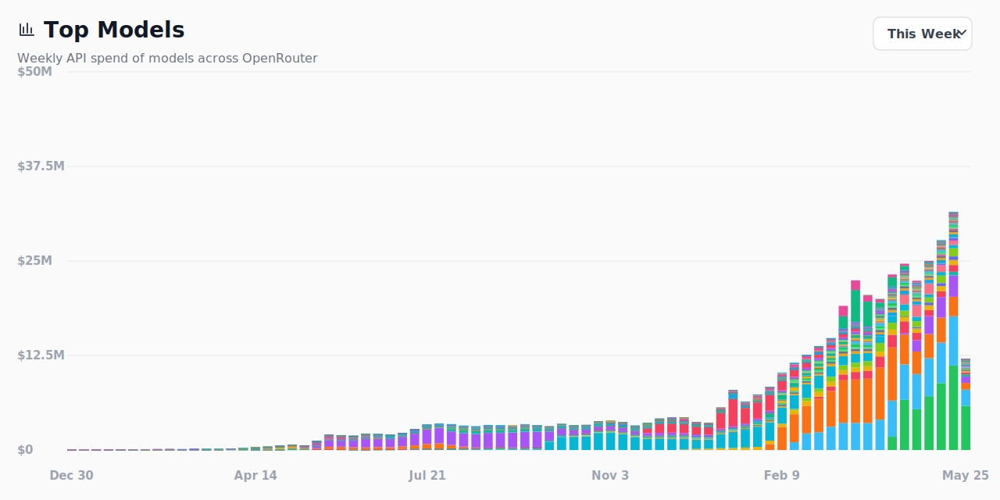

# OpenRouter Rankings USD Chart

Weekly OpenRouter model usage converted from tokens to estimated USD spend.

Live page: https://tobyge.github.io/openrouter-token-cost/



## Update

```bash
export OPENROUTER_API_KEY=<your-openrouter-api-key>
npm run refresh
npm run check
npm run preview
unset OPENROUTER_API_KEY

git add index.html assets/chart-preview.svg
git commit -m "Refresh OpenRouter spend data"
git push
```

Source: OpenRouter (`openrouter.ai/rankings`). Estimates use public model prices and exclude the official long-tail `other` row.
